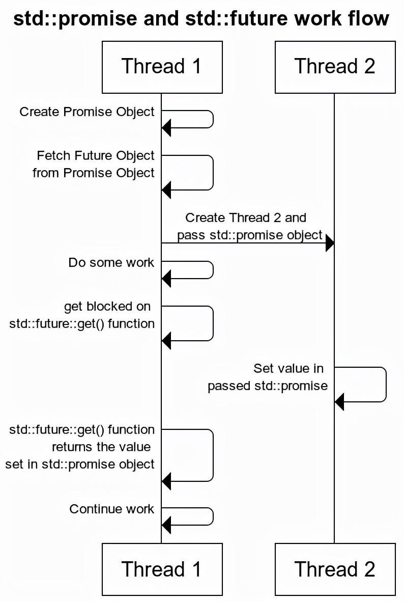
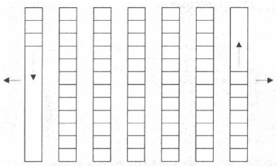
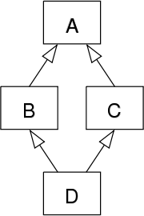

# 校招 C++ 大概学习到什么程度

> 写明白下面这几个代码 +能讲明白几个 C++11/14/17 的特性
> 
> MyString
> 
> MyVector
> 
> MyLRU
> 
> MySingleton
> 
> MyHashTable
> 
> MySharedPtr
> 
> MyUniquePtr
> 
> 再补一个 MyThreadPool
>
> MyRingbuffer
>
> MyReadWriteMutex
>
> [校招 C++ 大概学习到什么程度](https://www.zhihu.com/question/290102232/answer/14904708697)

# STL，C++11

## move 相关
这里需要构造一个方便指明不同对象的 class A，下面的实现是不符合复制、移动构造函数的语义的，请不要模仿：
```C++
#include <iostream>

using std::cout, std::endl;

class A {
public:
  int id = 0;

  A() { cout << "Construct A" << endl; }
  A(A &a) {
    this->id = a.id + 1;
    cout << "Copy A(" << a.id << ") to A(" << this->id << ");";
  }

  A(A &&a) {
    this->id = a.id + 1;
    cout << "Move A(" << a.id << ") to A(" << this->id << ")" << endl;
    a.id = -1;
  }

  ~A() { cout << "Destruct A(" << this->id << ")" << endl; }
};
```

### 会发生值复制以及创建临时对象的地方
列个表方便对比查看：
| class B 构造函数定义          | 运行代码                      | 输出                                                                                                       |
| ----------------------------- | ----------------------------- | ---------------------------------------------------------------------------------------------------------- |
|                               |
| B(A a) : _a(a) {}             | A aa; B b = B(aa);            | Construct A; Copy A(0) to A(1); Copy A(1) to A(2); Destruct A(1); **end;** Destruct A(2); Destruct A(0);   |
| B(A a) : _a(a) {}             | A aa; B b = B(std::move(aa)); | Construct A; Move A(0) to A(1); Copy A(1) to A(2); Destruct A(1); **end;** Destruct A(2); Destruct A(-1);  |
| B(A a) : _a(std::move(a)) {}  | A aa; B b = B(std::move(aa)); | Construct A; Move A(0) to A(1); Move A(1) to A(2); Destruct A(-1); **end;** Destruct A(2); Destruct A(-1); |
| B(A& a) : _a(std::move(a)) {} | A aa; B b = B(aa);            | Construct A; Move A(0) to A(1); **end;** Destruct A(1); Destruct A(-1);                                    |

注意 **end;** 插入的时机，**end;** 是在 main 函数结束之前，B 构造之后输出，这里是方便看清函数参数值复制时临时对象的产生与消失过程。
```C++
B(A a) : _a(a) {}
```
这段函数显然发生了两处值复制，一个是 B(aa) 处的 aa 会复制成 B(A a) 这个参数 a，然后 _a(a) 则是正常的复制拷贝函数调用。

这两处地方都可以使用 std::move 语义，但是显然 move 的使用并没有让临时对象少生成，因为 move 仅仅是改变资源（成员变量）在变量间的所有权，在 aa 外面套一层 move 壳仅仅会将 aa 从 A& 标记为 A&&。换言之，B(A a) 这个函数创建临时对象的过程仍然存在，只不过 move 会让本该调用复制构造函数的临时对象改成调用移动构造函数（反正无论怎样还是要构造的）。

### 返回值优化（Return Value Optimization, RVO）
返回值优化与临时对象是密切相关的，写了太多 Rust 以至于笔者下意识认为在栈上的对象是不可返回的，来梳理一下 C++ 返回值的过程，写一个测试函数如下：
```C++
auto test_RVO() -> A {
  A aa;
  aa.id += 10;
  return aa;
}

auto a = test_RVO();
```
> 这里需要禁用编译器的 RVO

在没有 move 前（CPP98）函数会输出 `Construct A; Copy A(10) to A(11); Destruct A(-1); end; Destruct A(11);`，有了 move（CPP11 之后）编译器就已经会把复制构造函数替换成移动构造函数了，输出 `Construct A; Move A(10) to A(11); Destruct A(-1); end; Destruct A(11);`。

这说明了，test_RVO 里的 aa 在不做 RVO 前确实会消失，但 C++ 会先把这个 aa 赋值给函数外面的 a 再删除 aa。

反正 aa 最终都要删除，那么把 aa 变量所有权改成 a 而不是重新复制一份就是 move 语义带来的优化。而 RVO 则更加激进，为什么一定要让 aa 消失呢？不如直接将 a 的内存地址改成 aa 就好，这时会输出 `Construct A; end; Destruct A(10);`。第二个优化会直接把第一个优化盖过去，所以可以看作时 move 优化的激进版。

**因此要慎重考虑返回值的析构函数调用问题。** move 语义不影响临时对象的创建，但是 RVO 会直接消除临时对象。

### 完美转发

### 万能引用（Universal Reference）

### 谈一下你对&，const &， &&的理解
也可以从右值构造函数那道题跳过来

### cast 操作符
C++98 的产物，`reinterpret_cast` 和 `const_cast` 都相当于绕过 C++ 的类型检查，有良好的代码设计都不会建议使用。

`dynamic_cast` 的转化效率令人诟病。
| 转换操作符         | 主要用途                                                                   | 适用场景                                                                                                                                        |
| ------------------ | -------------------------------------------------------------------------- | ----------------------------------------------------------------------------------------------------------------------------------------------- |
| `static_cast`      | 基本类型的转换、具有继承关系的类之间进行的类型转换、去除 void*指针的具体化 | 用于基础数据类型的转换（如 int 到 float）、具有直接继承关系的类之间的转换；不提供运行时检查                                                     |
| `dynamic_cast`     | 安全地处理多态类型的转换                                                   | 用于向下转型（即将基类指针或引用转换为派生类指针或引用），提供运行时检查确保转换的安全性                                                        |
| `reinterpret_cast` | 进行低级别的类型转换，可能涉及将一种类型的数据重新解释为另一种类型         | 适用于需要绕过 C++ 类型系统的情况，比如实现某些特定算法或与硬件直接交互；使用时需非常小心，因为可能导致 UB                                      |
| `const_cast`       | 添加或移除对象的常量属性                                                   | 专门用于添加或移除**引用**的 `const` 或 `volatile` 属性，当引用或指针指向的变量本身是 `const` 时，该变量由于储存在某块只读内存区域，可能触发 UB |

### 类型擦除相关记录

[从实践中学习类型擦除器](https://zhuanlan.zhihu.com/p/4381133249)

[最近被擦除式泛型恶心坏了。目前来讲，java 有没有可能会在未来重做泛型？原因又是什么？](https://www.zhihu.com/question/593114706)

## 智能指针相关
### shared_ptr 是否线程安全

`std::shared_ptr`的操作并非完全线程安全。具体来说：
- 单独的对象（实例）上的操作（例如解引用操作`*`和箭头操作符`->`）是线程安全的。
- 对同一个`shared_ptr`实例进行写操作（例如修改引用计数）需要同步机制来保证线程安全。
- 不同的`shared_ptr`实例即使它们共享相同的控制块也是线程安全的，因为引用计数的增加和减少是原子操作。

第 2 点的具体体现是在多线程中将某个 shared_ptr 以**引用**的方式传递给多个线程，这样 shared_ptr 的引用计数为 1，任一线程都可能导致 shared_ptr 被释放。而第 3 点则是将某个 shared_ptr 以**值复制**的方式传递给多个线程，这样 shared_ptr 的引用计数为 N，这也是线程安全的。

> 参考 [当我们谈论 shared_ptr 的线程安全性时，我们在谈论什么](https://zhuanlan.zhihu.com/p/416289479)

### 在循环引用中，两个节点，如果一个用 shared_ptr 指向另一个，另一个用 weak_ptr 回指。根据什么来判断什么对象该使用 shared_ptr 以及 weak_ptr？
在处理循环引用时，正确使用`std::shared_ptr`和`std::weak_ptr`可以避免内存泄漏。选择哪个节点使用`std::shared_ptr`，哪个节点使用`std::weak_ptr`，并不是基于节点的释放顺序，而是基于对象的所有权关系和生命周期管理。

#### 示例说明

假设有两个类`ClassA`和`ClassB`，其中`ClassA`实例需要持有对`ClassB`实例的长期引用，同时`ClassB`实例也需要反向引用`ClassA`实例。为了避免循环引用导致的内存泄漏：

- 如果`ClassA`的实例是`ClassB`实例的主要拥有者（例如，`ClassA`创建了`ClassB`，并且其逻辑上应该控制`ClassB`的生命周期），则在`ClassA`中使用`std::shared_ptr<ClassB>`，而在`ClassB`中使用`std::weak_ptr<ClassA>`来指向`ClassA`。
  
- 反之，如果`ClassB`是主要拥有者，则在`ClassB`中使用`std::shared_ptr<ClassA>`，并在`ClassA`中使用`std::weak_ptr<ClassB>`。

通过这种方式，可以确保对象能够按照预期的方式被销毁，不会因为循环引用而导致内存泄漏。重要的是理解各个对象之间的关系以及它们的生命周期，而不是简单地依赖于释放顺序来做决定。

### unique_ptr move 到 shared_ptr 会发生什么

当你将一个`std::unique_ptr`通过移动语义传递给`std::shared_ptr`时，所有权从`unique_ptr`转移到`shared_ptr`。这意味着：
- `unique_ptr`放弃对资源的所有权，并且之后不能再使用它来访问资源，因为它不再拥有该资源。
- `shared_ptr`接管资源并开始管理它。现在可以有多个`shared_ptr`共享同一资源，直到最后一个`shared_ptr`被销毁或重置，这时才会释放资源。

### unique_ptr 有什么特性，底层实现是怎样的，是怎么保证无法赋值构造的

### shared_ptr 怎么实现的，引用计数是什么数据格式，引用计数的线程安全怎么保证的，底层怎么实现

### 如何实现一个类，在父类没有虚析构函数的情况下，通过父类指针析构子类对象？
> 引入：在父类没有（忘记加）虚析构函数的情况下，父类的裸指针指向子类时，直接 delete 裸指针无法触发子类的析构函数，这是显然易见的。但是 `shared_ptr<A> ptr(new B);` 则会触发子类的析构函数，询问如何实现这个功能。
>
> [C++ 面试真题！如何实现一个类，在父类没有虚析构函数的情况下，通过父类指针析构子类对象？](https://zhuanlan.zhihu.com/p/662637642)

使用 `managet_ptr<B>` 与 `_shared_ptr<A>`，B 继承于 A，实现：
```C++
#include <iostream>
using namespace std;

class A
{
public:
    ~A() { cout << "A" << endl; }
};

class B : public A
{
public:
    ~B() { cout << "B" << endl; }
};


class manager
{
public:
    virtual ~manager() {}
};

template <class T>
class manager_ptr : public manager
{
public:
    manager_ptr(T p): ptr(p) {}
    ~manager_ptr() { delete ptr; }
private:
    T ptr;
};

template <class T>
class _shared_ptr
{
public:
    template<class Y>
    _shared_ptr(Y* p) { ptr_manager = new manager_ptr<Y*>(p); }
    ~_shared_ptr() { delete ptr_manager; }
private:
    manager* ptr_manager;
};

int main() {
    _shared_ptr<A> ptr(new B);
    return 0;
}
```

更简洁的，通过 `std::function` 包装保存类型信息：
```C++
template <typename T>
class MySharedV2
{
public:
    template <typename T2>
    MySharedV2(T2 *p)
    {
        data_ = p;
        deleter_ = [p](){ delete p;};
    }
    ~MySharedV2()
    {
        deleter_();
    }
    T* operator->()
    {
        return data_;
    }
private:
    std::function<void()> deleter_;
    T* data_ = nullptr;
};
```

**所以评论区提到的类型擦除和近似手动实现虚函数表是什么意思？**


## std::function
因为其他语言函数指针实现的太好了以至于想象不到 std::funtion 的作用，记录如下：
```C++
#include <functional> // 包含 std::function
#include <iostream>

// 接受普通函数指针的函数
void test_function_pointer(void (*func)(int, int)) { func(2, 3); }

// 接受 std::function 的函数
void test_function(std::function<void(int, int)> func) { func(2, 3); }

// 普通函数
void add(int x, int y) { std::cout << "Add: " << x + y << std::endl; }

// 成员函数
class MyClass {
public:
  void multiply(int x, int y) {
    std::cout << "Member function: " << x * y << std::endl;
  }
};

int main() {
  // 使用普通函数
  test_function_pointer(add);
  test_function(add);

  // Lambda 表达式，没有捕获外部变量
  auto lambda_no_capture = [](int x, int y) {
    std::cout << "Lambda no capture: " << x * y << std::endl;
  };

  int z = 10;
  // Lambda 表达式，有捕获外部变量
  auto lambda_with_capture = [z](int x, int y) {
    std::cout << "Lambda with capture: " << x + y + z << std::endl;
  };

  // Lambda 表达式（无捕获）
  test_function_pointer(lambda_no_capture);
  test_function(lambda_no_capture);

  // Lambda 表达式（有捕获）
  // test_function_pointer(lambda_with_capture); // 会报错
  test_function(lambda_with_capture);

  // 成员函数，this 指针是必要的，需要通过 std::bind 或者 lambda 来适配成
  // std::function
  MyClass obj;
  auto memberFunc = std::bind(&MyClass::multiply, &obj, std::placeholders::_1,
                              std::placeholders::_2);
  // test_function_pointer(memberFunc); // 会报错
  test_function(memberFunc);

  return 0;
}
```
由此可见 std::function 就是为了统一函数接口提出来的，由于是跟 lambda 函数、std::bind 一起提出来的，基本上可以看作是配套措施。rust 和 go 完全没有这种历史包袱，打一开始就是 lambda 函数和正常函数一样传。

lambda 函数不捕获变量也可以作为函数指针传入，但捕获变量了就不行（为什么呢，笔者也不知道）。

而类的非静态成员函数都有个 this 指针作为第一个参数，即使用了 std::bind 绑定了 this 指针，std::bind 返回的**可调用对象**（可调用对象是 C++11 对上述几种函数统一的称呼）也不能直接转成函数指针。那么在 C++11 前该怎么传入类的非静态成员函数呢，使用适配器模式即可的：
<details>
<summary>代码实现</summary>

```C++
#include <iostream>

class MyClass {
public:
    void display(int x) const {
        std::cout << "x: " << x << std::endl;
    }
};

// 定义一个适配器类来包装成员函数调用
class MemberFunctionWrapper {
public:
    MemberFunctionWrapper(MyClass* obj) : obj_(obj) {}

    void operator()(int x) const {
        obj_->display(x);
    }

private:
    MyClass* obj_;
};

void executeFunction(void (*func)(int), int arg) {
    func(arg);
}

template<typename Func>
void executeGenericFunction(Func func, int arg) {
    func(arg);
}

int main() {
    MyClass obj;

    // 使用适配器类
    MemberFunctionWrapper wrapper(&obj);
    executeGenericFunction(wrapper, 42); // 输出 "x: 42"

    return 0;
}
```
</details>


## std::future 和 std::promise、std::packaged_task、std::async
**需要注意的是 future 和 promise 是还是基于 thread 的，而非 coroutine**。毕竟是 C++11 就引入的，而 C++20 才有 coroutine 呢。

先声明 promise 然后获取绑定的 future，把 promise 丢到另一个线程里去，promise.set_value 就可以通过 future.get 了。


在 C++ 中，std::async、std::packaged_task 和 std::promise 都是用来处理异步任务和结果管理的工具，packaged_task 和 async 可以视作 promise 的高级封装（因为可以注意到大家都要搭配 future 用而不是搭配 promise 用）。

下面是对这三者的对比分析：

### `std::promise`
```cpp
std::promise<int> promise;
std::future<int> future = promise.get_future();

std::thread t([&promise]() {
    // 模拟一些工作
    promise.set_value(42); // 设置结果
});

int result = future.get(); // 获取结果
t.join(); // 等待线程完成
```

### `std::packaged_task`

```cpp
std::packaged_task<int()> task([]() { 
    return 42; 
});
std::future<int> future = task.get_future();

std::thread t(std::move(task)); // 在另一个线程上执行任务
t.join(); // 等待任务完成

int result = future.get(); // 获取结果
```

### `std::async`
```cpp
// 可以自动选择使用新线程（std::launch::async）或延迟执行（std::launch::deferred）
auto future = std::async(std::launch::async, []() { 
    // 异步任务
    return 42; 
});
int result = future.get(); // 获取结果
```

### 对比总结

| 特性/工具    | `std::promise`                 | `std::packaged_task`     | `std::async`       |
| ------------ | ------------------------------ | ------------------------ | ------------------ |
| 启动异步任务 | 不直接启动任务，需配合其他机制 | 手动，需自行安排执行环境 | 自动，支持多种策略 |
| 资源管理     | 需要手动管理                   | 需要手动管理             | 自动管理           |
| 使用便捷性   | 低（更灵活，但复杂）           | 中                       | 高                 |
| 控制灵活性   | 最高                           | 中等                     | 较低               |
| 适用场景     | 复杂同步需求，多上下文设置结果 | 快速简单异步任务         | 需要更多控制的任务 |


## STL 相关
### STL 容器是分配在堆还是栈
各种容器对象本身通常是分配在栈上的，但是它管理的动态数组（即其元素）是存储在堆上的。

### `sizeof(vector)` 返回的是 vector 对象大小还是容器大小
`sizeof(vector)` 返回的是该 `vector` 对象本身的大小，而不是它所管理的动态数组的大小。这个值通常包括几个指针或索引（如指向数据的指针、容量和大小等），因此它是一个相对较小且固定的数值。

### vector 的 clear() 的时间复杂度是多少？
抛开 POD 类型不谈，考虑到每个元素都需要做析构操作，实际复杂度会是 O(N)。

### 怎么在 vector 变量的有效期内，释放其中元素所占的内存？ 
这里我直接说一下答案。
```C++
vector<Data>().swap(v);
```

如果对方能正确写出，可以继续追问。如下写法是否也能达到目的？为什么？
```C++
v.swap(vector<Data>());
```

答案是不能。因为 swap 的参数是 T&，不能传递匿名对象。

### C++ 的 emplace_back 能完全代替 push_back 吗？
> [C++ 的 emplace_back 能完全代替 push_back 吗？](https://www.zhihu.com/question/387522517)

### `vector`
- **resize**：改变容器大小。如果新尺寸大于当前尺寸，则使用默认值或提供的值填充新增空间；如果小于当前尺寸，则删除多余的元素。
- **reserve**：请求容器分配足够的存储空间来容纳至少指定数量的元素，但不会改变容器的实际大小。这有助于减少内存重新分配的次数。

### `deque`
deque 通常作为一组独立区块，第一区块朝某方向扩展，最后一个区块朝另一个方向扩展。


- **resize**：类似于`vector`的`resize`，但是由于`deque`的内部结构不同（块状连续存储），其性能特征也有所不同。

### `unordered_set` / `unordered_map`
- **rehash**：调整容器的桶数，通常用于提高哈希表的性能。它强制容器重建其哈希表，可能导致所有元素的重定位。
- **load_factor**：获取或设置容器的负载因子，即每个桶的平均元素数。较高的负载因子可能导致更多的碰撞和降低查找性能。

### 插入一个元素后迭代器的有效性
| 容器名称                        | 插入后的迭代器有效性                                                                                                                         | 理由                                                                                                             |
| ------------------------------- | -------------------------------------------------------------------------------------------------------------------------------------------- | ---------------------------------------------------------------------------------------------------------------- |
| `list`/`forward_list`           | 迭代器不会失效。                                                                                                                             | `list`是双向链表，`forward_list`是单向链表，它们节点独立存在，插入新节点不会影响其他节点的位置或迭代器的有效性。 |
| `set`/`map`                     | 迭代器不会失效。                                                                                                                             | 因为它们通常基于平衡二叉树实现，插入新元素仅会改变树的结构，而不会使现有迭代器失效。                             |
| `vector`/`string`               | 如果容器内存被重新分配，则所有迭代器都失效，否则插入位置之后的迭代器都会失效。                                                               | 因为`vector`的底层实现是连续存储空间，插入可能导致内存重新分配，从而使迭代器失效。                               |
| `deque`（首尾两端的变化存疑）   | 增加任何元素都将使 deque 的迭代器失效，但两端插入时指针、引用仍有效。deque 是唯一一个在迭代器失效时不会使它的指针和引用失效的标准 STL 容器。 | `deque`支持两端快速插入。                                                                                        |
| `unordered_set`/`unordered_map` | 在没有发生 rehash 的情况下迭代器不会失效；如果发生了 rehash，则所有迭代器都将失效。                                                          | 当哈希表达到负载因子阈值时会发生 rehash，这会导致存储地址的变化，从而使得所有迭代器失效。                        |

### 删除一个元素后迭代器的有效性
| 容器名称                        | 删除后的迭代器有效性                                                                                                                                                             | 理由                                                                                                             |
| ------------------------------- | -------------------------------------------------------------------------------------------------------------------------------------------------------------------------------- | ---------------------------------------------------------------------------------------------------------------- |
| `list`/`forward_list`           | 只会使被删除元素迭代器失效。                                                                                                                                                     | `list`是双向链表，`forward_list`是单向链表，它们节点独立存在，删除新节点不会影响其他节点的位置或迭代器的有效性。 |
| `set`/`map`                     | 只会使被删除元素迭代器失效。                                                                                                                                                     | 因为它们通常基于平衡二叉树实现，删除新元素仅会改变树的结构，而不会使现有迭代器失效。                             |
| `vector`/`string`               | 被删除元素之后的迭代器都会失效。                                                                                                                                                 | 因为`vector`的底层实现是连续存储空间，删除不会导致内存重新分配。                                                 |
| `deque`（首尾两端的变化存疑）   | 在 deque 的中间删除元素将使迭代器、指针、引用失效，而在头或尾删除元素时，只有指向该元素的迭代器失效。deque 是唯一一个在迭代器失效时可能不会使它的指针和引用失效的标准 STL 容器。 | `deque`支持两端快速删除。                                                                                        |
| `unordered_set`/`unordered_map` | 只会使被删除元素迭代器失效。                                                                                                                                                     |                                                                                                                  |

### 如何高效删除 C++ vector 中所有下标为偶数的元素？


# 模板函数
## 类模板全特化与偏特化
<details>
<summary>代码实现</summary>

```C++
#include <iostream>

using namespace std;

template <class T1, class T2> class Test {
public:
  Test(T1 a, T2 b) : _a(a), _b(b) { cout << "模板化" << endl; }

private:
  T1 _a;
  T2 _b;
};

//模板全特化
template <> class Test<int, int> {
public:
  Test(int a, int b) : _a(a), _b(b) { cout << "模板全特化" << endl; }

private:
  int _a;
  int _b;
};

//模板偏特化
template <class T> class Test<int, T> {
public:
  Test(int a, T b) : _a(a), _b(b) { cout << "模板偏特化" << endl; }

private:
  int _a;
  T _b;
};
```
</details>

## 函数模板特化
1. 函数模板只有特化，没有偏特化（函数模板偏特化等价于新的一个模板函数，故没有偏特化的说法）；
2. 模板、模板的特化和模板的偏特化都存在的情况下，编译器在编译阶段进行匹配，优先特殊的；
3. 模板函数不能是虚函数；因为每个包含虚函数的类具有一个 virtual table，包含该类的所有虚函数的地址，因此 vtable 的大小是确定的。模板只有被使用时才会被实例化，将其声明为虚函数会使 vtable 的大小不确定。所以，成员函数模板不能为虚函数。

# 面向对象
## 构造函数
只有构造函数可以重载，其他的默认函数（复制构造、移动构造和析构函数）都有唯一的函数签名，不可重载。
### 初始化列表

### explicit 关键字
指定构造函数或转换函数（C++11 起）为显式，即它不能用于**隐式转换**和复制初始化。

explicit 关键字**只对有一个参数的类构造函数有效**，如果类构造函数参数大于或等于两个时，是不会产生隐式转换的，所以 explicit 关键字也就无效了。

但是，也有一个例外，就是当**除了第一个参数以外的其他参数都有默认值的时候**（每个参数都有默认值也可以的，如下例，核心要点在于是否可以触发隐式转换），explicit 关键字依然有效，此时，当调用构造函数时只传入一个参数，等效于只有一个参数的类构造函数。
```C++
class Point {
public:
    int x, y;
    Point(int x = 0, int y = 0)
        : x(x), y(y) {}
};

int main()
{
    displayPoint(1);
    Point p = 1;
}
```

上述 `Point p = 1;` 会触发 `Point(int x = 0, int y = 0)` 这个构造函数的隐式调用，C++ 就是这样的自由。因此为了禁止这种行为可以使用 explicit 关键字如下：

```C++
class Point {
public:
    int x, y;
    explicit Point(int x = 0, int y = 0)
        : x(x), y(y) {}
};

int main()
{
    // Point p = 1;  // 会报错
    Point p(1);   // 正常写法
}
```


## 析构函数
只有析构函数可以为虚函数，其他的构造函数（构造函数、复制构造和移动构造）都不能为虚函数。因为虚函数表在构造函数之前并没有初始化好，类是不知道该去找哪个虚函数执行的。

## 复制构造函数
函数签名为
```C++
T(T& t)
```

对于复制构造函数，虽然其不能为虚函数，但是很容易可以实现一个虚函数 `Clone()` 实现相同效果：
```C++
class BaseShape
{
public:
   // ...
   virtual BaseShape *Clone() = 0;
};

class Square : public BaseShape
{
public:
   // ...
   Square *Clone()
   {
      return new Square(*this);
   }
};
class Rectangle : public BaseShape
{
public:
   // ...
   Rectangle *Clone()
   {
      return new Rectangle(*this);
   }
};
```

## 移动构造函数
函数签名为
```C++
T(T&& t)
```

## = 操作符重载
操作重载会把复制构造和移动构造的逻辑重复一遍，但是考虑为方便链式调用，函数签名为：
```C++
// 以移动构造为例
T& operator =(T&& t){
    ...
    return *this;
}
```
这里的返回参数写法与构造操作没有任何关系，不返回 *this 也完全不影响单个的 a=b; 赋值式子，主要是方便链式调用。
### a = b = c; 的调用顺序
视作 a = (b = c); ，也就是 b 调用 = 操作符复制了 c，然后返回了 b（*this 就是 b 本身），a 再调用 = 操作符复制 b。

## 菱形继承


使用 `class B: virtual public A` 这个**虚继承**语法使得 A 在任意派生类中只存一份，由此解决。

虚继承通常涉及到一个额外的开销，因为编译器需要维护虚基类的信息，以确保在运行时可以正确地构造和定位虚基类的实例。因此，只有在需要解决菱形问题时才应该使用虚继承。

因为支持多继承，引入了菱形继承问题，又因为要解决菱形继承问题，引入了虚继承。而经过分析，人们发现我们其实真正想要使用多继承的情况并不多。

所以，在 Java 中，不允许“声明多继承”，即一个类不允许继承多个父类。但是 Java 允许“实现多继承”，即一个类可以实现多个接口，一个接口也可以继承多个父接口。由于接口只允许有方法声明而不允许有方法实现（Java 8 之前），这就避免了 C++ 中多继承的歧义问题。

## 用 C++ 实现一个日志系统，可以被调用，要求性能最好。先思考三分钟，说一下思路，伪代码实现。
设计一个高性能的日志系统，需要考虑几个关键点：
- 线程安全
- 最小化日志记录对主程序性能的影响
- 灵活的日志级别支持
- 易于扩展和维护。

以下是实现这样一个系统的思路：
### 思路

1. **日志级别**：定义不同的日志级别（如 DEBUG、INFO、WARNING、ERROR），让用户能够根据需要控制输出的详细程度。

2. **异步日志记录**：为了避免在记录日志时阻塞主线程，采用生产者 - 消费者模式，使用队列来缓存日志消息，并在一个单独的线程中处理这些消息。

3. **高效写入**：为了提高写入效率，可以将多个日志条目批量写入到文件中，减少磁盘 I/O 操作次数。

4. **线程安全**：确保多线程环境下的安全性，特别是当有多个线程同时尝试记录日志时。

5. **格式化与过滤**：提供灵活的日志格式化选项和过滤机制，允许用户自定义哪些级别的日志应当被记录下来。

<details>
<summary>伪代码实现</summary>

```cpp
#include <queue>
#include <thread>
#include <mutex>
#include <condition_variable>
#include <string>
#include <vector>

enum LogLevel {
    DEBUG, INFO, WARNING, ERROR
};

class LogMessage {
public:
    LogLevel level;
    std::string content;
    // 构造函数等
};

class Logger {
private:
    std::queue<LogMessage> logQueue;
    std::mutex queueMutex;
    std::condition_variable cv;
    std::thread workerThread;
    bool running = true;

    void worker() {
        while (running || !logQueue.empty()) {
            std::unique_lock<std::mutex> lock(queueMutex);
            cv.wait(lock, [this] { return !running || !logQueue.empty(); });
            while (!logQueue.empty()) {
                auto logMsg = logQueue.front();
                logQueue.pop();
                // 批量处理并写入日志
                writeToFile(logMsg);
            }
        }
    }

    void writeToFile(const LogMessage& msg) {
        // 实现具体的写入逻辑
    }

public:
    Logger() {
        workerThread = std::thread(&Logger::worker, this);
    }

    ~Logger() {
        {
            std::lock_guard<std::mutex> lock(queueMutex);
            running = false;
        }
        cv.notify_all();
        workerThread.join();
    }

    void log(LogLevel level, const std::string& message) {
        if (level >= currentLevel) {
            std::lock_guard<std::mutex> lock(queueMutex);
            logQueue.emplace(LogMessage{level, message});
            cv.notify_one();
        }
    }

    LogLevel currentLevel = INFO; // 默认日志级别
};

// 使用示例
Logger logger;
logger.log(INFO, "This is an info message.");
```
</details>

这个伪代码展示了如何创建一个简单的异步日志系统。实际应用中可能还需要增加更多的功能，比如配置文件的支持、多种输出目标（文件、控制台等）、更复杂的格式化选项等。此外，还可以通过调整队列大小、批量写入策略等方式进一步优化性能。

## 多线程打印奇偶数
为了实现多线程打印奇数和偶数，我们可以使用 C++ 中的线程同步机制来确保两个线程能够正确地交替执行，即一个线程打印奇数，另一个线程打印偶数。这里可以使用互斥锁（`std::mutex`）和条件变量（`std::condition_variable`）来控制两个线程的执行顺序。

以下是一个简单的例子展示如何使用 C++ 实现这一功能：

<details>
<summary>代码实现</summary>

```cpp
#include <iostream>
#include <thread>
#include <mutex>
#include <condition_variable>

std::mutex mtx;
std::condition_variable cv;
bool ready = false; // 标志位，用于指示是否准备好打印下一个数字
int number = 1; // 要打印的数字

void printOdd()
{
    while(number < 10) // 假设我们打印到 9 为止
    {
        std::unique_lock<std::mutex> lck(mtx);
        cv.wait(lck, []{return !ready;}); // 等待直到轮到打印奇数
        
        if(number % 2 != 0)
        {
            std::cout << "Odd: " << number << std::endl;
            ++number;
            ready = true; // 设置标志位，表示下一个应该是偶数
            cv.notify_all(); // 通知其他等待的线程
        }
    }
}

void printEven()
{
    while(number < 10)
    {
        std::unique_lock<std::mutex> lck(mtx);
        cv.wait(lck, []{return ready;}); // 等待直到轮到打印偶数
        
        if(number % 2 == 0)
        {
            std::cout << "Even: " << number << std::endl;
            ++number;
            ready = false; // 设置标志位，表示下一个应该是奇数
            cv.notify_all();
        }
    }
}

int main()
{
    std::thread t1(printOdd);
    std::thread t2(printEven);

    t1.join();
    t2.join();

    return 0;
}
```
</details>

这段代码创建了两个线程`t1`和`t2`，分别用于打印奇数和偶数。通过使用互斥锁和条件变量，我们保证了在任意时刻只有一个线程在执行，并且确保了奇数和偶数按照正确的顺序被打印出来。在这个例子中，我们假设打印的范围是 1 到 9，当然这个范围可以根据需要调整。

## Golang 与 C++ 的区别
Go（通常称为 Golang）和 C++ 是两种不同的编程语言，它们在设计理念、使用场景以及实现方式上都有显著的区别：

1. **内存管理**：C++ 提供了对内存的细粒度控制，包括手动管理内存分配和释放（如通过 `new` 和 `delete`）。而 Go 采用垃圾回收机制自动管理内存，简化了程序员的工作负担。

2. **并发模型**：Go 内置支持轻量级线程（goroutines），并通过通道（channels）来简化并发编程。相比之下，C++ 需要借助标准库或第三方库来实现类似的并发功能，代码通常更加复杂。

4. **编译速度与效率**：Go 设计之初就考虑到了快速编译，其编译速度通常比 C++ 快很多。这使得开发迭代过程更快。

5. **面向对象编程**：虽然 Go 支持一些面向对象的概念，但没有传统意义上的类和继承层次。C++ 提供了完整的面向对象编程支持，包括类、继承、多态等特性。

### Go 的“轻量”体现在什么地方？

- **Goroutines**：Go 的 goroutines 比传统的线程更加轻量，占用更少的系统资源，允许轻松创建成千上万的并发任务。
  
- **快速编译**：Go 编译速度快，有助于提高开发效率。

- **简单易用的标准库**：Go 提供了一个强大且易于使用的标准库，许多常见的编程任务可以直接利用这些库来完成，无需引入额外的依赖。

### Go 的劣势在哪？

尽管 Go 有许多优点，但它也存在一些限制和不足之处：

- **性能优化难度**：对于某些需要极致性能的应用场景，Go 可能不如 C++ 灵活，尤其是在需要精细控制硬件资源时。

# GDB 多线程调试小连招
我用过 gdb，比如调试正在运行的程序，先用 ps -ef 获取 pid，然后使用 gdb attach pid。

调试多线程，我会先 list 看看在哪行源码，或者在那个 cpp 文件，break 可以 xxx.cpp:30，在某个文件上第 30 行打个断点，然后 run 跑起来，info thread 左上角的星号是正在执行的线程，可以用 thread id 来切换线程，还可以用 set scheduler-locking 来设置只让一根线程执行。
