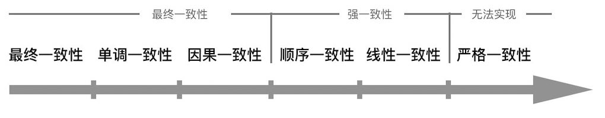
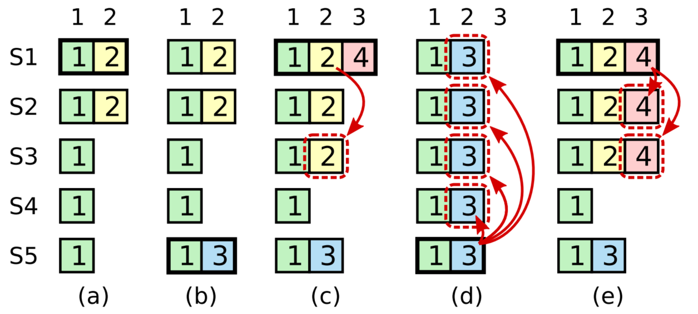
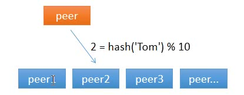

按理说，做完了 6.824 理应对 Raft 了如指掌，可那是 11 个月前了，如今的笔者只能依稀记起来 lab 中印象较深的几个坑（其实也记不太清了。

所以可证明，做完 lab $\not=$ 面经全会。

为了让面试官不阴阳怪气\委婉\盛气凌人地跟笔者说——同学，你的项目是有借鉴 Github 吗？——记录一下笔者从各大网站搜罗而来的 Raft 协议面经。

## CAP 是什么？Raft 实现了 CAP 中的哪两个
CAP（Consistency, Availability, Partition tolerance）。CA 只有单机实现，毕竟分布式系统必须有 Partition tolerance。对于强调自己可无缝替代 Mysql 的 TiDB，C 是一定要实现的，只有 A 是可以舍弃的，毕竟停止服务怎么说也比转账事务出错好。

### 弱一致性——最终一致性
无法实时获取最新更新的数据，但是一段时间过后，数据是一致的

笔者浅薄的阅历导致只知道 Gossip 一种最终一致性算法，Consul、Cassandra、Redis、DynamoDB 等等都只是用这个算法来故障检测用的，换言之 Gossip 主要用来同步集群状态，它的生态位其实是跟注册中心差不多的。

比如 Redis Cluster 使用 Gossip 无非就是保证了某个主节点掉线，集群和相应的从节点探测到后可以靠选举自动顶上并恢复服务（使用的还是 Raft 的 Leader Election 方法）。Redis Cluster 都是使用哈希分片让每个主节点管理一部分数据，两个主节点间是不会交换真正的键值对数据的。因此在 Redis Cluster 出现之前，互联网大厂也完全可以靠 zookeeper 做一个 proxy 管理各个 redis 主从节点的配置和请求收发（比如 Codis）。

### 强一致性
- Paxos
- Raft
- ZAB
- Quorum NWR

其中 Quorum NWR 算法略微有些特殊，根据 N、W、R 参数不同有强一致性或者最终一致性的效果，写入需 W 个副本成功，读取需 R 个副本响应，R + W > N 即可强一致性，否则就是最终一致性。

而 Raft 和 ZAB 都可以看作是 Multi Paxos 的变体。

据 PingCAP 所分享：
> 一些常见的误解：使用了 Raft 或者 Paxos 的系统都是线性一致的（Linearizability，即强一致），其实不然，共识算法只能提供基础，要实现线性一致还需要在算法之上做出更多的努力。以 TiKV 为例，它的共识算法是 Raft，在 Raft 的保证下，TiKV 提供了满足线性一致性的服务。

笔者猜测一下 PingCAP 的意思，Raft 没想好，但是 Quorum NWR 在 W+R>N 的情况下，比如 N=5，写 3 个读 3 个，能确保读出来 [V1,V1,V2] 这种组合，V1 和 V2 肯定有一个是最新的，那么还需要接着读直到有一个的数量超过 2 个，理论上是这样。

假如这时混入了 V3 这个值，V1 和 V2 的分布就不对了，单纯的算法就读不到超过 2 个的值，但这个事完全可以通过引入时间戳和 undo log 来解决，这与算法是没关系的。所以算法是基础，要实现线性一致还需要系统配合（？

## Raft 和其他共识协议相比的优缺点
### Leader
Raft 有 Leader，对于强一致性算法，Basic Paxos 是没有的（Multi Paxos 加入了 Leader，Raft 和 ZAB 本身也可视作 Multi Paxos 的变种），Quorom 也是没有的；对于弱一致性算法，Gossip 当然也没有。

因此 Raft 在网络条件良好的情况下只需要一个 RPC 回合同步消息即可成功达成共识，而 Basic Paxos 达成共识需要两个 RPC 回合——时间更长；Quorom 算法需要同时给多个服务器发送写请求——带宽更大，而且读取的话还存在读放大现象；Gossip 更是只能以 log(N) 的时间复杂度实现最终一致性。

那么成也 Leader 败也 Leader，Leader 掉线了自然就会影响 Raft 的可用性，而 Quorom 和 Gossip 就不会受影响。

#### Paxos
> [OceanBase 的一致性协议为什么选择 paxos 而不是 raft?](https://www.zhihu.com/question/52337912)

### 拜占庭问题
拜占庭问题主要是考虑恶意攻击者乱发共识消息导致最终共识错误的问题，这类问题当然不应该在各大互联网数据中心这种地方考虑，因此 Paxos 系列算法完全没有解决这个问题，而 PBFT、POW 算法则解决了这个问题。

PBFT 在金融等高安全场景适用，但复杂度极高（需三次消息传递：预准备、准备、提交），且节点数量受限（如 3f+1）。

## Raft 过程

## 什么时候做日志压缩
这是 LSM-Tree 的内容，不会。

## 为什么 Raft 的 RPC 需要带上任期号，举例不带任期号导致的错误场景
### 场景 1：旧领导者重新连接导致数据不一致
假设：
1. 初始状态：节点 A 在任期 1 是领导者，日志索引已推进到 index=100。
2. 网络分区：节点 A 因网络故障与集群断开，其他节点超时后发起选举，选出节点 B 作为任期 2 的新领导者。
3. 旧领导者恢复：节点 A 恢复连接后，仍认为自己是任期 1 的领导者，并尝试发送心跳（AppendEntries RPC）到节点 B。
4. 消息缺少任期号：假设节点 A 的心跳消息未携带任期号，仅包含日志信息（如 prevLogIndex=100）。
5. 节点 B 的状态：节点 B 的日志索引可能停留在 index=50（因为新领导者刚上任，尚未追加新日志）。

此时：
1. 节点 B 接收到节点 A 的心跳，发现其日志索引 index=100 远高于自己的 index=50，仅凭索引判断，会误认为节点 A 的日志更先进，从而接受其心跳并跟随节点 A。
2. 这导致节点 B 错误地接受旧领导者（任期 1 的 A），而实际当前任期是 2，破坏了 Raft 的一致性保证。

### 场景 2：选举中的投票混乱
假设：
1. 当前任期：集群处于任期 3，节点 C 是领导者。
2. 候选者竞争：节点 D 在任期 3 发起选举，发送带任期号的投票请求。
3. 旧候选者干扰：节点 B 在任期 2 发起选举，发送不带任期号的投票请求。
4. 节点 E 的决策：节点 E 收到节点 D（任期 3）和节点 B 的投票请求，但无法通过任期号判断哪个更新，只能根据其他信息（如索引）或随机选择。

此时：
- 节点 E 可能错误地将选票投给任期 2 的节点 B（因为其日志索引可能更高），导致节点 B 获得多数票成为领导者，而实际任期 3 的领导者 C 仍合法存在，造成脑裂（Split-Brain）。

而且上述两个场景还是只考虑所有日志的起点一定从 0 开始，但实际考虑到日志压缩与快照机制，Leader 压缩了日志长度导致自身保存的 index 减小，此时其他节点没压缩的话会引发更多的问题，因此任期号是必要的。

## 如果 Raft 给一部分节点发送数据操作的过程中突然宕机了怎么办？
超时重选

## Raft 优化
> prevote 阶段
> 
> no-op 解决 figure 8
>
> ReadIndex 与 Lease Read

### prevote
少于半数的 Follower 和 Candidate 陷入分区意味着 RequestVote 和 AppendEntries RPC 将失败。Raft 会无限期的重试，直到服务器重新启动。这时该分区的任期号将不断递增，最终合并分区时将导致新一轮的选举，这轮选举是不必要的。

### no-op
Commit 限制：仅提交 leader 当前 term 的日志条目。

为什么要增加这个限制？我们同样基于这个图进行场景模拟就知道了。

- 阶段（a）：S1 是 leader，收到请求后仅复制 index2 的日志给了 S2，尚未复制给 S3 ~ S5；
- 阶段（b）：S1 崩溃，S5 凭借 S3、S4 和自身的投票当选为 term3 的 leader，收到请求后保存了与 index2 不同的条目（term3），此时尚未复制给其他节点；
- 阶段（c）：S5 崩溃，S1 重新启动，当选为新任 leader（term4），并继续复制，将 term2, index2 复制给了 S3。这个时候 term2,index2 已经的日志条目已复制到大多数的服务器上，但是还没提交。
- 阶段（d）：如果 S1 如 d 阶段所示，又崩溃了，S5 重新当选了 leader（获得 S2、S3、S4 的选票）然后将 term3, index2 的条目赋值给了所有的节点并 commit。那这个时候，已经 committed 的 term2, index2 被 term3, index2 覆盖了。

因此，为了避免上述情况，commit 需要增加一个额外的限制：仅 commit leader 当前 term 的日志条目。
如图，在 c 阶段，即使 term4 的时候 S1 已经把 term2, index2 复制给了大多数节点，但是它也不能直接将其 commit，必须等待 term4 的日志并成功复制后一起 commit。
所以除非说阶段 c 中 term2, index2 始终没有被 commit，这样 S5 在阶段 d 将其覆盖就是安全的，在要么就是像阶段 e 一样，term2, index2 跟 term4, index3 一起被 commit，这样 S5 根本就无法当选 leader，因为大多数节点的日志都比它新，也就不存在前边的问题了。

### ReadIndex 与 Lease Read

## Raft 集群发生网络分区会怎么样

## Raft 成员变更
> https://zhuanlan.zhihu.com/p/359206808

- 要么一次性严格限制只变更一个节点。
- 如果实在想一次变更多个节点，那就不能直接变更，需要经过一个中间状态的过渡之后才能完成同时变更多个节点的操作。第一次从 C_Old 变成{C_Old,C_New}节点集合，第二次从{C_Old,C_New}变成 C_New。

## Raft 具体实现（比如 etcd）有哪些值得借鉴的
### Tick 机制
> 这里说下整个规则，上层的 RawNode 会定时调用 `Tick()`，驱动 Raft，同时如果有消息，则通过 `Step()` 函数传递给 Raft。然后 Raft 进行一系列的处理。将需要发送给其他节点的消息存放在 r.msgs 中，RawNode 会在生成 Ready 的时候取走并发送给别的节点。
> 
> 整一个流程是线性的，`Tick()` 和 `Step()` 不会被同时触发，这里不存在多线程的情况。

Tick 驱动导致 Raft 状态机易于测试，比 2022 年的 6.824 要好，否则就要靠随机事件来测试 bug 了。

## 如果有多个节点竞选 Leader 怎么办？

## Raft leader 选举过程

## 分布式系统中如果有多个分区，每个分区都有一个 Leader，现在将分区合并有多个 Leader 如何处理？

## 怎么区分 Leader 分别属于第几轮选举的？（Leader 选取的轮次计数）

## Raft 算法中如果 Leader 宕机后怎么办？

## 如果 Raft 集群超过半数节点挂了会怎么样

## 上层业务如何使用 Raft？（面试官想的是和 etcd 那样单独作为一个存储服务

## Raft 如何高可用

## KV 存储如何容错

## multi-Raft 实现

## multi-Raft 怎么分片，分片怎么迁移

## multi-Raft 原理（用哈希分片好吗？）

## TiDB 的架构

## 项目的性能怎么样？最难的是什么？

## Percolator 原理

## 一致性 Hash 算法是什么？为什么需要一致性 Hash 算法？
对于分布式缓存来说，当一个节点接收到请求，如果该节点并没有存储缓存值，那么它面临的难题是，从谁那获取数据？自己，还是节点 1, 2, 3, 4… 。假设包括自己在内一共有 10 个节点，当一个节点接收到请求时，随机选择一个节点，由该节点从数据源获取数据。

那有什么办法，对于给定的 key，每一次都选择同一个节点呢？使用 hash 算法也能够做到这一点。那把 key 的每一个字符的 ASCII 码加起来，再除以 10 取余数可以吗？当然可以，这可以认为是自定义的 hash 算法。

简单求取 Hash 值解决了缓存性能的问题，但是没有考虑节点数量变化的场景。假设移除了 10 个节点其中一台节点，只剩下 9 个，那么之前 `hash(key) % 10` 变成了 `hash(key) % 9`，也就意味着几乎缓存值对应的节点都发生了改变。即几乎所有的缓存值都失效了。节点在接收到对应的请求时，均需要重新去数据源获取数据，容易引起 `缓存雪崩`。

**一致性哈希算法**将 key 映射到 2^32 的空间中，将这个数字首尾相连，形成一个环。
- 计算节点/机器 (通常使用节点的名称、编号和 IP 地址) 的哈希值，放置在环上。
- 计算 key 的哈希值，放置在环上，**顺时针**寻找到的第一个节点，就是应选取的节点/机器。
  

环上有 peer2，peer4，peer6 三个节点，`key11`，`key2`，`key27` 均映射到 peer2，`key23` 映射到 peer4。此时，如果新增节点/机器 peer8，假设它新增位置如图所示，那么只有 `key27` 从 peer2 调整到 peer8，其余的映射均没有发生改变。

也就是说，一致性哈希算法，在新增/删除节点时，只需要重新定位该节点附近的一小部分数据，而不需要重新定位所有的节点，这就解决了上述的问题。

## 一致性 Hash 的缺点是什么？
数据不平衡——虚拟节点解决

## DHT 系统
