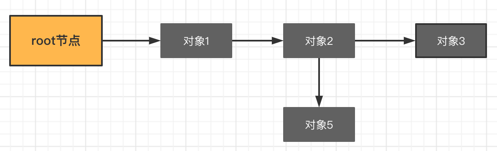

## 标记清除法
标记清除法主要包含两个步骤：
- 标记
- 清除

示例如下：
1. 开启 STW，停止程序的运行，图中是本次 GC 涉及到的 root 节点和相关对象。

1. 从根节点出发，标记所有可达对象。

1. 停止 STW，然后回收所有未被标记的对象

标记清除法的最大弊端就是在**整个 GC 期间需要 STW**，将整个程序暂停。因为如果不进行 STW 的话，会出现已经被标记的对象 A，引用了新的未被标记的对象 B，但由于对象 A 已经标记过了，不会再重新扫描 A 对 B 的可达性，从而将 B 对象当做垃圾回收掉。

## 三色标记法
三色标记法将对象用三种颜色表示，分别是白色、灰色和黑色。

最开始所有对象都是白色的，然后把其中全局变量和函数栈里的对象置为灰色。第二步把灰色的对象全部置为黑色，然后把原先灰色对象指向的变量都置为灰色，以此类推。等发现没有对象可以被置为灰色时，所有的白色变量就一定是需要被清理的垃圾了。

1. 初始标记阶段，指的是标记 GCRoots 直接引用的节点，将它们标记为灰色，这个阶段需要「Stop the World」。
2. 并发标记阶段，指的是从灰色节点开始，去扫描整个引用链，然后将它们标记为黑色，这个阶段不需要「Stop the World」。
3. 重新标记阶段，指的是去校正并发标记阶段的错误，这个阶段需要「Stop the World」。
4. 并发清除，指的是将已经确定为垃圾的对象清除掉，这个阶段不需要「Stop the World」。

三色标记法因为多了一个白色的状态来存放不确定的对象，所以可以异步地执行。但需要注意，三色标记法是一个 False Negative（假阴性）的算法——异步执行的代价是可能会造成一些遗漏，这里的遗漏是指会保留一部分垃圾，而不是会清除本不该清除的活动对象。说到底假阳性对于 GC 算法才是不可接受的。