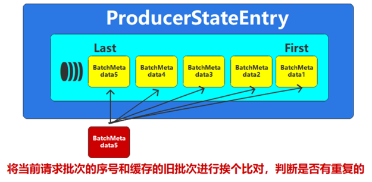
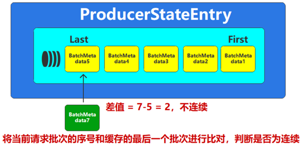
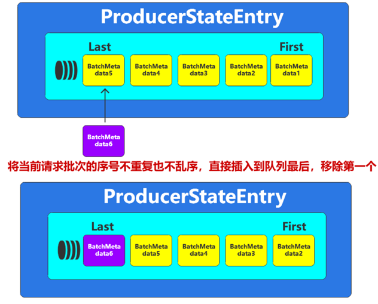

## 数据传输语义
| 传输语义      | 说明                                                                                                 | 例子                 |
| ------------- | ---------------------------------------------------------------------------------------------------- | -------------------- |
| at most once  | 最多一次：不管是否能接收到，数据最多只传一次。这样数据可能会丢失，                                   | Socket，ACK=0        |
| at least once | 最少一次：消息不会丢失，如果接收不到，那么就继续发，所以会发送多次，直到收到为止，有可能出现数据重复 | ACK=-1               |
| Exactly once  | 精准一次：消息只会一次，不会丢，也不会重复。                                                         | 幂等 + 事务 + ACK=-1 |

### Acks
- 0，参考 UDP 协议，Producer 只管发。
- 1，只需要 Leader Broker 确认接收即可。熟悉分布式 DB 的朋友们都知道，没有多数 Follower 的 Commit 是不保证线性一致性的，这只是一个工程上的性能与正确性的 tradeoff。
- -1 或者 all，需要多数 Follower 确认。

### 幂等性
引入 ProducerID 和 SequenceNumber，Producer 需要做的只有两件事：
1. 初始化时像向 Broker 申请一个 ProducerID
2. 为每条消息绑定一个 SequenceNumber

然后使用滑动窗口确保消息不丢失（现在持有 1-5 号，7 号数据到了会要求重发 6 号数据）以及去重，这解决了**数据乱序**与**数据重复**两个问题。

但由于使用 (ProducerID, SequenceNumber) 去重，因此只能保证**单分区**（因为一条消息只会发给一个 Partition）和**单会话**（Producer 重启会改变 ProducerID）的幂等性。

### 分布式事务
典型的 2PC（2-Phase Commit）流程。