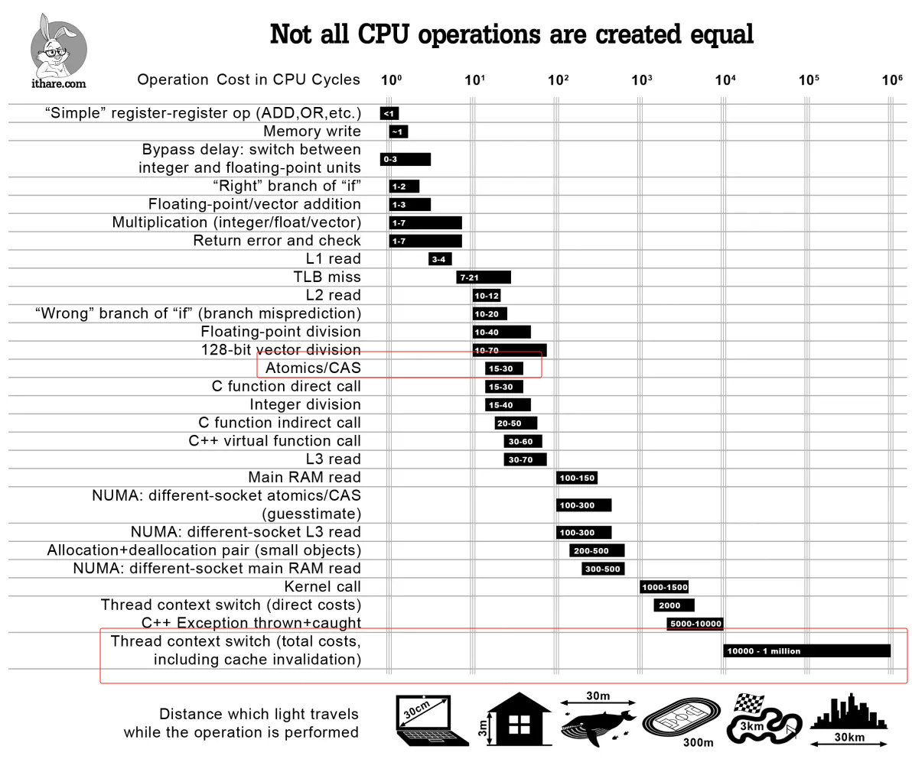
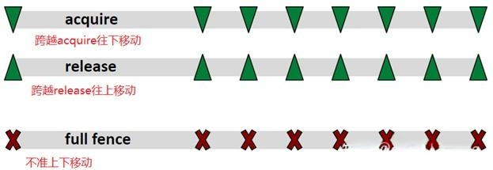

仍然是面试速记。

## 死锁的 408 八股
考研 408 必背八股，谁都会问，但笔者全都以举例的方式逃过去了，不过还是记一下。

### 死锁的四大条件与预防死锁的四大方法（一一对应）
- `资源互斥`，最不可能取消的条件，不互斥的资源自然也不会有同步需求，各管各的就好
- `持有并等待`，反义词是检测到死锁就回退并重新获取锁，抛开极端情况不谈（时机恰恰好到无论怎么回退，两个资源争夺方都会以相同的顺序抢夺资源然后失败），这种方式比较好实现
- `不可剥夺`，反义词是按某种规则检测到死锁后就老杀新或者新杀老，这样能保证同一时间一定有一个任务能被推进下去，被杀死的任务自动回退即可
- `环路等待`，反义词是保持资源申请顺序一致，比如数据库给数据加行锁，无论是给哪条数据加，都要从第一条数据开始加，然后给每条数据依次加，不如直接加个大表锁，性能肯定更好，因此实践中其实比较难保证资源申请顺序一致。当然也有 B-tree 的 crabbing 协议这样的精巧的数据结构上锁方式。这个条件是基于`持有并等待`与`不可剥夺`才能成立的条件，一般来说无论是不满足`持有并等待`还是不满足`不可剥夺`，`环路等待`都将不成立。

### 避免死锁
预防死锁是设计静态的系统规则预防死锁，而避免死锁则是使用**安全序列**申请资源以避免系统进入死锁状态（换言之使用不安全序列申请资源的话，系统还是会进入死锁状态）。

银行家算法。不介绍，因为这是建立在申请资源信息全知的状态下的算法，银行由于使用某些算法能算出来大家的信用额度和需求所以还能用一下，计算机系统是基本做不到的。这个算法就和 OPT 页面置换算法一样，无法使用在实际系统中。

### 检测和处理死锁
`环路等待` 条件的细化处理，反正死锁肯定是有环了，检测出来再破坏掉`持有并等待`或者`不可剥夺`条件就好了。

## CAS（Compare And Set 或者 Compare And Swap）函数
自旋锁（或者 CAS 锁）威名远扬，但首先需要清楚 CAS 函数并非 CAS 锁，自旋锁与 CAS 函数之间尚且存在一些实现思想需要记一下。

自旋锁是依托于 `Test And Set` 等 CPU 指令实现的锁，其核心在于 CAS 函数，以下是 CAS 函数的伪代码：
```C
int compare_and_swap (int* reg, int oldval, int newval)
{
  int old_reg_val = *reg;
  if (old_reg_val == oldval) *reg = newval;
  return old_reg_val;
}
```
需要将这三行代码看作一个整体，举例有：

### 使用 CAS 函数实现 lock 与 unlock 函数（最普通的自旋锁\Spin Lock\CAS 锁，反正都一个意思）
1. 约定 lock 操作是 `while(compare_and_swap(lock, 0, 1)==1)`，unlock 操作是 `lock = 0`。
2. `compare_and_swap(lock, 0, 1)` 意味着 lock 为 0 时函数设置 lock 为 1 并返回 0，lock 为 1 时函数直接返回 1。
3. 考虑两个线程 A 与 B 同时发出了这条指令：
   - A 线程首先执行，lock 初始化为 0，它将 lock 置为 1 后并返回 0，得以退出 while 循环执行后续代码；
   - 而执行到 B 这条指令时，lock 为 1，因此 B 会不断的执行 `while(1=1)` 这一逻辑，直到 A unlock。

换言之，只要双方实现约定好两个值，这里的 0 和 1 可以变成任意 x 和 y 变量以达成相同的效果。

从上述过程也能看出自旋锁为什么被称为轻量级锁的原因。相较于会导致线程切换（陷入内核，保存线程 context，加入等待序列巴拉巴拉）的锁，自旋锁只需一条指令检测一次，lock 为 0 了立马就能获得锁，这可太轻量级了。如下图，如果说 CAS 请求一个锁的开销是从房间的一端走到另一端，上下文切换的开销大约就相当于跑 3 公里：



所以自旋锁在什么时候会更高效呢？线程切换需要先将 B 切走然后再切回来，这之间起码几十条指令执行的时间。也就是说，当判断程序临界区只需最多十几条指令（反正小于两次线程切换所需的时间，JVM 的锁升级过程就是先来 10 条 CAS 指令等一等，等不到才换成线程切换的锁）就能执行完成时，自旋锁理论上一定是会比线程切换更加高效的。

### 使用 CAS 函数实现的无锁链表
那么难道就只有 `compare_and_swap(lock, 0, 1)` 这样的固定写死 0 和 1 这两个值的使用方式吗？并非如此，因为 CAS 还能将 0 和 1 换成变量以实现无锁链表。

比如说希望只靠 `compare_and_swap` 函数实现**线程安全**的链表插入操作：
```C
bool insert(Node* prev, Node* newNode) {
    Node* next = prev->next;
    newNode->next = next;
    while(next = compare_and_swap(&prev->next, next, newNode)){
        if(newNode->next == next){
            break;
        }
        newNode->next = next;
    }
    return true;
}
```

上述操作的逻辑为：
1. 首先将 newNode->next 设置为 prev->next，该操作是线程安全的，毕竟不会有多个线程同时插入同一个 newNode
2. 然后试图将 prev->next 设置为 newNode，这里需要考虑多线程同时设置不同的 newNode 会导致某些 newNode 更改丢失的竞态问题，也就是多条 prev->next 赋值语句先后执行会导致以前的值被覆盖
3. `compare_and_swap` 怎么解决这个问题的？`compare_and_swap` 保证了对于同一个 next（即 prev->next 的旧值），有不同 newNode 的多条指令只会成功设置一条。这条指令成功后，其他指令就会失败并返回 prev->next 的新值。
4. 那么如何分辨谁成功谁失败了？不妨假设 newNodeA 插入成功、newNodeB\C\D 插入失败。这时可以检测 `next == newNode->next`：
   - 相等则意味着 newNode 已经插入成功了，可以跳出 while 循环了；
   - 不等则意味着 newNode 插入失败，这时的 next 实际上已经是更新过的 prev->next 了（即成功插入的 newNodeA）所以需要重新将 newNodeB/C/D->next 设置为新的 next 再次执行 cas 操作。可以预见的是接下来假如 newNodeB 插入成功，又需要将 newNodeC/D->next 指向 B 然后继续 cas，以此类推。

注意到上述代码并没有使用 CAS 实现的 lock 操作（即自旋锁），而是直接使用了 CAS 函数，此谓之无锁链表（允许吐槽）。

也可以思考这个无锁链表相较于有锁链表优化了什么地方，比如经典的有锁链表实现：
```C
bool insert(Node* prev, Node* newNode) {
    mutex.lock();
    Node* next = prev->next;
    newNode->next = next;
    prev->next = newNode;
    mutex.unlock();
    return true;
}
```

对比可以发现就是使得 `newNode->next = next;` 这一步可以无锁运行了，但是这也带来了额外的判断 `next == newNode->next` 的开销以及失败重试导致的多次 `newNode->next = next;` 赋值开销，因此无锁链表这种微妙的结构在实际应用场景中并不一定就比单纯的自旋锁性能高到哪去，相当难以用好。

要不是...腾讯起手无锁编程:（，笔者也想...

## C++ 与 Java 锁的设计
### 可重入锁
C++ 拥有 `std::mutex` 和 `std::recursive_mutex`两种 Mutex，后者拥有在同一线程反复上锁的能力，也就是可重入锁（Reentrant Lock）。提供两种选择向来是 C++ 所谓零成本抽象的思想体现，绝大部分场景都用不上后者，所以要阉割掉后者的计数功能压榨性能。

Java 的 Synchronized 和 ReentrantLock 都提供了可重入锁的功能，原理都一样：
> 底层是利用计算机系统 mutex Lock 实现的。每一个可重入锁都会关联一个线程 ID 和一个锁状态 status。
> 
> 当一个线程请求方法时，会去检查锁状态。
> 
> 1. 如果锁状态是 0，代表该锁没有被占用，使用 CAS 操作获取锁，将线程 ID 替换成自己的线程 ID。
> 2. 如果锁状态不是 0，代表有线程在访问该方法。此时，如果线程 ID 是自己的线程 ID，如果是可重入锁，会将 status 自增 1，然后获取到该锁，进而执行相应的方法；如果是非重入锁，就会进入阻塞队列等待。
>
> [synchronized 支持重入吗？如何实现的？](https://xiaolincoding.com/interview/juc.html#%E6%80%8E%E4%B9%88%E7%90%86%E8%A7%A3%E5%8F%AF%E9%87%8D%E5%85%A5%E9%94%81)

### 锁升级
> **锁膨胀**：synchronized 从无锁升级到偏向锁，再到轻量级锁，最后到重量级锁的过程，它叫做锁膨胀也叫做锁升级。JDK 1.6 之前，synchronized 是重量级锁，也就是说 synchronized 在释放和获取锁时都会从用户态转换成内核态，而转换的效率是比较低的。但有了锁膨胀机制之后，synchronized 的状态就多了无锁、偏向锁以及轻量级锁了，这时候在进行并发操作时，大部分的场景都不需要用户态到内核态的转换了，这样就大幅的提升了 synchronized 的性能。

首先考虑使用自旋锁，N 次等待后再选择线程切换的锁，该过程可称为锁升级。

笔者初次在 Java 里看到，但在搜索过程中发现 Linux 自己的 Futex 也有一样的锁升级策略，所以笔者可以大胆推测基本上所有语言的 Mutex 都有类似的过程，也许只不过是 Java 强调了这点。

JDK 15 后移除了偏向锁这一机制，这一机制主要是为了优化 Java 以前默认线程安全的集合（HashTable、Vector）的无冲突访问性能的（加锁很耗性能），不过现在已经有了 JUC 这类性能更高的线程安全集合（ConcurrentHashMap、CopyOnWriteArrayList）和默认线程不安全的集合（HashMap、ArrayList），偏向锁显得不再必要，因此被移除了。

#### 数据库的偏向锁（意向锁）
表级锁，异曲同工之妙。

### 锁降级
锁降级是指在持有写锁的情况下再申请读锁然后释放写锁，达成写锁降级为读锁的过程。实际上不仅 Java，这种操作在数据库事务中也很常见。

需要注意，这一过程需要可重入锁的支持，否则持有写锁的时候申请读锁是会死锁的，参考[多线程代码示例](#多线程代码示例)中的读写锁实现。

### Java volatile、原子变量与内存序
Java 的 volatile 比 C/C++ 的 volatile 提供的语义强上不少，拥有与原子变量一致的 load/store 操作，但是没有自增自减操作。在面经中常常提到 volatile 有两点作用：
- 保证变量对所有线程的可见性，由于 CPU 存在 L1/L2/L3 缓存，因此很多变量操作并不一定会写回主存被其他线程所感知，而 **volatitle 能保证数据更改一定被刷回主存**
- 禁止指令重排序优化，靠插入下列屏障解决：
  1. 写 - 写屏障，在对 volatile 变量执行写操作之前，会插入一个写屏障。这确保了在该变量写操作之前的所有普通写操作都已完成，防止了这些写操作被移到 volatile 写操作之后。
  2. 读 - 写屏障，在对 volatile 变量执行读操作之后，会插入一个读屏障。它确保了对 volatile 变量的读操作之后的所有普通读操作都不会被提前到 volatile 读之前执行，保证了读取到的数据是最新的。
  3. 写 - 读屏障，这是最重要的一个屏障，它发生在 volatile 写之后和 volatile 读之前。这个屏障确保了 volatile 写操作之前的所有内存操作（包括写操作）都不会被重排序到 volatile 读之后，同时也确保了 volatile 读操作之后的所有内存操作（包括读操作）都不会被重排序到 volatile 写之前。

原子变量的 load/store 操作也提供了以上保证，但最主要的是原子变量还会提供具有原子性的自增自减操作。这一操作本身倒是没什么好说的，不必引入线程切换，大家都会提到加个小自旋锁然后 ++/-- 就好。

不过单纯的屏障解释让人看不太清背后的机理，还是要从内存序说起。

以下基本参考自 [现代 C++ 的内存模型](https://zhuanlan.zhihu.com/p/382372072)。

现代计算机系统总是会做各种各样的优化，这些优化最终会导致某些过程在单线程下符合逻辑地运行，但在多线程下就运行错误了。
#### 指令重排（Reordering）
指令重排在编译器优化与 CPU 乱序执行时都会涉及到，总之会发生并且导致多线程不可控的结果。

#### Invention
> 再来说 Invention，其实这主要涉及 CPU 的 [Speculative execution](https://en.wikipedia.org/wiki/Speculative_execution)，我们看如下代码，
```C++
// Invention示例代码
// 原始代码
if( cond ) x = 42;

// 优化后代码
r1 = x;// read what's there
x = 42;// oops: optimistic write is not conditional
if( !cond)// check if we guessed wrong
    x = r1;// oops: back-out write is not SC
```
> 我们看到，相比于最初的代码，多了一次对 x 的写入。同样，对于单线程来说，没有什么问题，但是对于多线程，显然是有问题的，另一个线程在 cond 为 false 的情况下，依然可能看到 x 为 42。

但是**上述优化并不会让临界区内的代码被移出临界区外运行**，不如说，正是因为大家意识到这些优化会导致多线程结果混乱，因此不会对明显标记了 lock/unlock 的多线程区域做此类优化。

注意，只是不会让临界区内的代码被移出临界区外，因此对于 lock 操作，lock 操作之前的代码是可以被挪入临界区内执行的；对于 unlock 操作，unlock 之后的代码也可以挪入临界区执行。因此 lock 与 unlock 操作分别对应一个单向的内存屏障。如下图，lock/unlock 与 acquire/release 对应：



可以将 acquire/release 想象成一个内部代码无法逃离的闭区间，那么仅需将它两的顺序掉换成 release/acquire，那么显然这就是一个全向的 full fence 了，所有代码都无法跨过这个内存屏障。

来个表速记：

| Memory order 枚举值  | 意义                                                                                                                                                                                                                                                              |
| -------------------- | ----------------------------------------------------------------------------------------------------------------------------------------------------------------------------------------------------------------------------------------------------------------- |
| memory_order_relaxed | 对于其它读写操作没有任何同步和重排的限制，仅要求保证原子性和内存一致性（见最后的例子说明）。                                                                                                                                                                      |
| memory_order_consume | 类似于 memory_order_acquire，也是用于 load 操作，但更为宽松，请先参考 acquire 的说明。区别在于，load 操作所在的线程仅能看到对于依赖于该原子变量的写操作的结果。                                                                                                   |
| memory_order_acquire | 对于使用该枚举值的 load 操作，不允许该 load 之后的操作重排到 load 之前。若同一原子变量的 store 操作 (使用 memory_order_release，在另一线程) Synchronizes-with 该 load 操作，则另一线程 store 操作之前的所有写操作的结果，对当前线程 load 操作之后的所有操作可见。 |
| memory_order_release | 使用该枚举值的 store 操作，不允许 store 之前的操作重排到 store 之后。Store(release) 操作可以与 load(Acquire/Consume) 配合使用，见 acquire/consume 解释。                                                                                                          |
| memory_order_acq_rel | 用于 RMW 原子操作，RMW 操作前后的语句都不允许跨越该操作而重排。该操作相当于兼具 load(acquire) 和 store(release)，可以看作由这两个操作组成，但是整体上是原子的。                                                                                                   |
| memory_order_seq_cst | Load/store/RMW 操作都可以使用该枚举值，这些操作依然分别具有 Acquire 语义/Release 语义/Acquire&Release 语义，且所有操作都相当于一个双向屏障，前后语句都不能跨越该操作进行重排。并且所有线程的语句都以全局的内存修改顺序为参照。                                    |

然而，并不是所有枚举值都适用于所有原子操作。适配关系总结如下表：

| 操作              | 有效的 Memory order 枚举值                                                                                                         | 备注                                                                |
| ----------------- | ---------------------------------------------------------------------------------------------------------------------------------- | ------------------------------------------------------------------- |
| Load              | memory_order_relaxed, memory_order_consume,            memory_order_acquire,  memory_order_seq_cst                                 | 其它枚举值不合法，MS STL 的实现是将其当作 memory_order_seq_cst 处理 |
| Store             | memory_order_relaxed, memory_order_release,  memory_order_seq_cst                                                                  | 同上                                                                |
| read-modify-write | memory_order_relaxed, memory_order_consume, memory_order_acquire, memory_order_release, memory_order_acq_rel, memory_order_seq_cst |                                                                     |

显然可以将内存序与 Java 提到的屏障一一对应起来：
1. 写 - 写屏障，对应 load 的 memory_order_release
2. 读 - 写屏障，对应 store 的 memory_order_acquire
3. 写 - 读屏障，对应 memory_order_seq_cst 或者 memory_order_acq_rel（？）笔者学艺不精，不知道 Java 到底会不会保证全局内存修改顺序，面经说是会保证内存一致性，但是又没说保证全局内存修改顺序。

但总的来说，Java 的 volatile 关键字确实提供了相当强力的保障。

#### order_relaxed 例子
```C++
// 松散模型
std::atomic<bool> x(false),y(false);
std::atomic<int> z(0);
void write_x_then_y()    // thread 1
{
    x.store(true,std::memory_order_relaxed);
    y.store(true,std::memory_order_relaxed);
}
void read_y_then_x()     // thread 2
{
    while(!y.load(std::memory_order_relaxed));
    if(x.load(std::memory_order_relaxed))
        ++z;
}
```

执行结果，z 值可能为 0。其实很简单，若 y.store 重排于 x.store 之前，便可得出结论。

重排可以发生在编译器，也可以在 CPU/Cache。例如，将写入结果先缓存至 Store Buffer，最后写入内存，但是 Store Buffer 到内存，可能会先写 y 再写 x（先进后出），这样也相当于重排。所以正如前面的优化分析所述，我们无需关注优化发生在哪一层，我们只需关注这种优化是否发生以及发生后的影响，以便我们进行分析。当然，即使不是重排，也有可能，例如，线程 2 对于 x 的读取，可能读取的是 cache 而非内存。

从上述代码执行结果来看，这很反直觉，很不直观，而且很容易出错。因此 Herb Sutter 在 atomic weapons 上建议不要使用这种模型，但是因为有些 CPU 平台，例如 Power/ARMv7，要保证顺序一致开销很大，所以 C++ 内存模型才包含了 Relaxed ordering。

从前面的表 2 可知，Relaxed ordering 仅要求保证原子性和内存修改顺序一致性（modification order consistency）。原子性不用多说。举例说一下修改顺序一致性，

```C++
// 内存修改顺序一致性
std::atomic<int> x(0),y(0);

// thread 1
for(unsigned i=0;i<10;++i) {
    auto x1=x.load(std::memory_order_relaxed);
    auto y1=y.load(std::memory_order_relaxed);
    x.store(i+1, std::memory_order_relaxed);
    std::cout << "(" << x1 << "," << y1 << ")" << std::endl;
    std::this_thread::yield();
}

// thread 2
for(unsigned i=0;i<10;++i) {
    auto x1=x.load(std::memory_order_relaxed);
    auto y1=y.load(std::memory_order_relaxed);
    y.store(i+1, std::memory_order_relaxed);
    std::cout << "(" << x1 << "," << y1 << ")" << std::endl;
    std::this_thread::yield();
}
```
假设上述两个线程同时分别执行两个 for 循环，那么，输出的结果可能如下：
```
线程 1：(0,0),(1,0),(2,0),(3,0),(4,0),(5,7),(6,7),(7,9),(8,9), (9,9)
线程 2：(0,0),(0,1),(0,2),(1,3),(8,4),(8,5),(8,6),(8,7),(10,8),(10,9)
```
由上述结果可知，对于线程中的变量，例如线程 1 中的 x，其写入的值必定会被同一个线程后续的读取操作所读取，即使写入仅发生在 Store Buffer，而未写入到内存。因而我们看到了线程 1 输出中连续递增的 x（load/store 都在线程 1）。而线程 2 对于 x 的读取（x 的写入操作在线程 1），并不一定能读取到 x 的最新值，但如果能读取到（证明线程 1 将该值写入了内存），则也是按照 x 的写入顺序，即假设读取到 8 之后，后续读取不可能是 8 之前的值（即小于 8 的值）。


## 多线程代码示例
### 3 个线程交替打印 1~100
使用条件变量（Condition Variable）来协调线程的执行顺序。
#### C++
<details>
<summary>C++ 代码示例</summary>

```cpp
#include <iostream>
#include <thread>
#include <mutex>
#include <condition_variable>

std::mutex mtx;
std::condition_variable cv;
int current = 1; // 当前要打印的数字
const int maxNum = 100;

void printNumbers(int threadID, int mod) {
    while (current <= maxNum) {
        std::unique_lock<std::mutex> lock(mtx);
        cv.wait(lock, [mod] { return (current - 1) % 3 == mod; }); // 确保当前线程是正确的轮次
        if(current <= maxNum){
            std::cout << "Thread " << threadID << ": " << current++ << std::endl;
        }
        lock.unlock();
        cv.notify_all(); // 通知其他等待的线程
    }
}

int main() {
    std::thread threads[3];
    for (int i = 0; i < 3; ++i) {
        threads[i] = std::thread(printNumbers, i + 1, i);
    }
    for (auto &th : threads) th.join();
    return 0;
}
```
</details>

#### Java
<details>
<summary>Java 代码示例</summary>

```java
public class AlternatePrinting {

    private static final Object lock = new Object();
    private static int current = 1;
    private static final int maxNum = 100;

    public static void main(String[] args) {
        Thread[] threads = new Thread[3];
        for (int i = 0; i < 3; i++) {
            final int index = i;
            threads[i] = new Thread(() -> {
                while (current <= maxNum) {
                    synchronized (lock) {
                        while ((current - 1) % 3 != index) {
                            try {
                                lock.wait();
                            } catch (InterruptedException e) {
                                Thread.currentThread().interrupt();
                            }
                        }
                        if(current <= maxNum){
                            System.out.println("Thread " + (index + 1) + ": " + current++);
                        }
                        lock.notifyAll();
                    }
                }
            });
            threads[i].start();
        }
        for (Thread th : threads) {
            try {
                th.join();
            } catch (InterruptedException e) {
                Thread.currentThread().interrupt();
            }
        }
    }
}
```
</details>


### 读写锁
读写锁是解决经典读者 - 写者问题的方案。一般分为读优先（一直有读者在就永远不让写）、写优先（一直有写者在就永远不让读）以及公平锁（按顺序获取锁，不存在读者或写者饥饿问题）。

#### C++

<details>
<summary>C++ 读优先 - 读写锁</summary>

```cpp
#include <iostream>
#include <thread>
#include <mutex>
#include <condition_variable>

class SimpleRWLock {
private:
    std::mutex mutex_;
    std::condition_variable cv_;
    int readers_ = 0; // 当前活跃的读者数量
    bool writer_active_ = false; // 是否有写者在工作

public:
    void lock_read() {
        std::unique_lock<std::mutex> lock(mutex_);
        cv_.wait(lock, [this]() { return !writer_active_; });
        ++readers_;
    }

    void unlock_read() {
        std::lock_guard<std::mutex> lock(mutex_);
        --readers_;
        if (readers_ == 0) {
            cv_.notify_all();
        }
    }

    void lock_write() {
        std::unique_lock<std::mutex> lock(mutex_);
        cv_.wait(lock, [this]() { return !writer_active_ && readers_ == 0; });
        writer_active_ = true;
    }

    void unlock_write() {
        std::lock_guard<std::mutex> lock(mutex_);
        writer_active_ = false;
        cv_.notify_all();
    }
};

SimpleRWLock rwlock;

void reader(int id) {
    rwlock.lock_read();
    std::cout << "Reader " << id << " is reading.\n";
    std::this_thread::sleep_for(std::chrono::milliseconds(100));
    rwlock.unlock_read();
}

void writer(int id) {
    rwlock.lock_write();
    std::cout << "Writer " << id << " is writing.\n";
    std::this_thread::sleep_for(std::chrono::milliseconds(300));
    rwlock.unlock_write();
}

int main() {
    std::vector<std::thread> threads;
    for (int i = 1; i <= 5; ++i) {
        threads.emplace_back(reader, i);
        threads.emplace_back(writer, i);
    }
    for (auto &th : threads) th.join();
    return 0;
}
```
</details>

<details>
<summary>C++ 写优先 - 读写锁</summary>

```C++
#include <iostream>
#include <thread>
#include <mutex>
#include <condition_variable>

class WriterPreferenceRWLock {
private:
    std::mutex mutex_;
    std::condition_variable cv_;
    int readers_ = 0; // 当前活跃的读者数量
    bool writer_active_ = false; // 是否有写者在工作
    bool writers_waiting_ = false; // 是否有写者在等待

public:
    void lock_read() {
        std::unique_lock<std::mutex> lock(mutex_);
        cv_.wait(lock, [this]() { return !writer_active_ && !writers_waiting_; });
        ++readers_;
    }

    void unlock_read() {
        std::lock_guard<std::mutex> lock(mutex_);
        --readers_;
        if (readers_ == 0) {
            cv_.notify_all();
        }
    }

    void lock_write() {
        std::unique_lock<std::mutex> lock(mutex_);
        writers_waiting_ = true;
        cv_.wait(lock, [this]() { return !writer_active_ && readers_ == 0; });
        writer_active_ = true;
        writers_waiting_ = false;
    }

    void unlock_write() {
        std::lock_guard<std::mutex> lock(mutex_);
        writer_active_ = false;
        cv_.notify_all();
    }
};

// 示例函数略...
```
</details>

<details>
<summary>C++ 公平锁 - 读写锁</summary>

```C++
#include <iostream>
#include <thread>
#include <mutex>
#include <condition_variable>
#include <queue>
#include <chrono>

class FairRWLock {
private:
    std::mutex mutex_;
    std::condition_variable cv_;
    bool writer_active_ = false; // 是否有写者在工作
    int readers_ = 0; // 当前活跃的读者数量
    std::queue<std::pair<bool, std::promise<void>>> waiters_; // 请求队列，bool表示是读者(false)还是写者(true)

public:
    void lock_read() {
        std::unique_lock<std::mutex> lock(mutex_);
        auto pr = std::promise<void>();
        auto f = pr.get_future();
        waiters_.emplace(false, std::move(pr));
        cv_.notify_one(); // 唤醒可能的等待线程
        f.wait(); // 等待信号

        if (waiters_.front().first == false) { // 如果头部是我们自己的请求
            ++readers_;
            waiters_.pop();
        }
    }

    void unlock_read() {
        std::lock_guard<std::mutex> lock(mutex_);
        --readers_;
        if (readers_ == 0) {
            cv_.notify_all(); // 可能有一个写者在等待
        }
    }

    void lock_write() {
        std::unique_lock<std::mutex> lock(mutex_);
        auto pr = std::promise<void>();
        auto f = pr.get_future();
        waiters_.emplace(true, std::move(pr));
        cv_.notify_one(); // 唤醒可能的等待线程
        f.wait(); // 等待信号

        if (waiters_.front().first == true) { // 如果头部是我们自己的请求
            writer_active_ = true;
            waiters_.pop();
        }
    }

    void unlock_write() {
        std::lock_guard<std::mutex> lock(mutex_);
        writer_active_ = false;
        cv_.notify_all(); // 唤醒下一个等待者（可能是读者或写者）
    }

    void check_and_signal() {
        std::unique_lock<std::mutex> lock(mutex_);
        while (!waiters_.empty()) {
            auto& front = waiters_.front();
            if (front.first == false && !writer_active_) { // 如果是读者且无写者活动
                front.second.set_value(); // 允许读者继续
            } else if (front.first == true && readers_ == 0 && !writer_active_) { // 如果是写者且无读者和写者活动
                front.second.set_value(); // 允许写者继续
            } else {
                break; // 没有符合条件的等待者，退出循环
            }
        }
    }

    void signal_waiters() {
        std::unique_lock<std::mutex> lock(mutex_);
        cv_.wait(lock, [this]() { return !waiters_.empty(); });
        check_and_signal();
    }
};

// 示例函数略...
```
</details>

