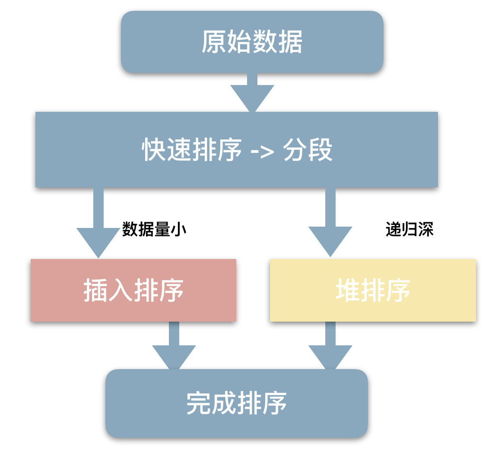

# sort
## Golang
大体思路是：
- 先算出 maxDepth = logN，在递归次数不超过 maxDepth 的情况下：
  - 数据量>12 使用**快排**。
    - 快排本身取 Pivot 哨兵时不采用随机取，而是用 Tukey's ninther 算法取数组中位数。
  - 否则数据量小一点先使用**希尔排序**，再**插入排序**。
- 当递归次数超过 maxDepth 时，这时对当前数组进行**堆排序**。因为这种数据分布一般就是基本有序的。比如**Leetcode 912.排序数组**最后的几个测试用例，全 2 或者倒序，快排会达到$O(N^2)$的时间复杂度。

> 以上参考自 
> https://boilingfrog.github.io/2022/03/06/go%E4%B8%AD%E7%9A%84sort%E5%8C%85/

## C++
STL 的 sort 算法与 Golang 基本一致，同样是：
- 快排递归分段。
- 一旦分段后的数据量<16，为避免 QuickSort 快排的递归调用带来过大的额外负荷，就改用插入排序。
- 如果递归层次过深，改用堆排序。
